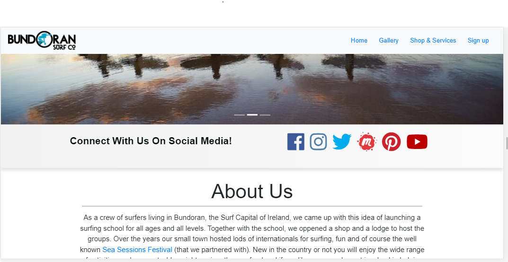
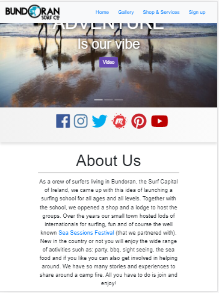
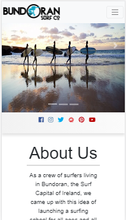

SURFING IN BUNDORAN WEBSITE

View live project here: https://misstechy.github.io/Surfing-in-Bundoran/
This website is user friendly and interactive for surf lovers. It is predictable, clear, responsive and accesible.

|  |  |  

User Experience(UX)

First Time Visitor Goals

1.Interested in learning about the organization and also looking to find the information easily.

2.Interested in simplicity, acurasy and clarity of website's information.

3. Interested in reviews, videos and photos of other people who experienced the services, as well as the packages they offer, and also connecting with them on social media.

Returning Visitor Goals

1.As a Returning Visitor I would be interested in address, phone number, email address or social media accounts.

2.As a Returning Visitor I would look for links or photos so I can show my friends and gather a group.

3.As a Returning Visitor I would want to see in a easily maner the packages.

Frequent User Goals

1.Interested in signing up for more information.

2. Interested if the social media was updated and if I can find them on meetup as it offers a secured way to pay a service. 

3.Interested in finding out the dates of the Sea Sessions Festival, purchase equipmant, watch videos.

Design

Colour Scheme

Predominant colors: red, gray, white, blue (different shades), black and a bit of yellow.

Typography

The Roboto font is the main font used throughout the whole website with Sans Serif as the fallback font in case for any reason the font isn't being imported into the site correctly.

Imagery

Images are imported from Bundoran Surf CO. social media accounts and they can be found on home page, gallery, services and signin page. Images are not made by a professional therefore their scope is to intrigue and attract the user.

Wireframes
I did not use any Wireframes (Balsamiq/other apps/pen and papper. I built the design as I continued with my project. I can say I went with what was pleasant to the eye.

Features

Responsive on all device sizes.

Interactive elements.

Technologies Used

Languages Used

HTML5

CSS3

Frameworks, Libraries & Programs Used

Bootstrap 4.5.x:

Bootstrap was used to assist with the responsiveness and styling of the website, such as: nav bar, carousel image, social jumbotron, cards, testimonials, columns, sign up and sign in.

Google Fonts:

Google fonts were used to import the 'Roboto' font into the style.css file which is used on all pages throughout the project.

Font Awesome:

Font Awesome was used on all pages throughout the website to add icons for aesthetic and UX purposes.

jQuery:
jQuery came with Bootstrap to make the navbar responsive but was also used for the smooth scroll function in JavaScript.

Git:

Git was used for version control by utilizing the Gitpod terminal to commit to Git and Push to GitHub.

GitHub:

GitHub is used to store the projects code after being pushed from Git.

Testing

The W3C Markup Validator, W3C CSS Validator Services, Inspect in browser,HTML Formater - all were used to test, arrange and fix code.

https://jigsaw.w3.org/css-validator/#validate_by_input

https://validator.w3.org/

https://webformatter.com/

Testing User Stories from User Experience (UX) Section

First Time Visitor Goals

1.As a First Time Visitor, I want to easily understand the main purpose of the site and learn more about the organisation.Upon entering the site, users are automatically greeted with a clean and easily readable navigation bar to go to the page of their choice (home page, gallery page, services page and sign up page). Underneath there is a carousel image with Text and a "video" Calling to action button. The button takes you to Bundoran Surf Youtube page where users can see their promo video.
Underneath the carousel images there is an "About Us" section describing the team, their passion and the goals, and also a hyper link with the Sea sessions Festival.

2.As a First Time Visitor, I want to be able to easily be able to navigate throughout the site to find content.At the bottom of the  3 pages the user will find the partners, opening and closing hours, address, phone number and email address. At the Sign in page I am able to sign in or sign up for more information.

3.As a First Time Visitor, I want to look for reviews, partners and social media links to see how popular is Bundoran Surf Co and if there are any unpleasant situations. 

Returning Visitor Goals

1.As a Returning Visitor I would be interested in address, phone number, email address or social media accounts. Once I decide to take the service or buy a product I will need a phone number, address and to follow them online so I will be updated.

2.As a Returning Visitor I would look for links or photos so I can show my friends and gather a group. Photos gives a feeling of joy therefore I would share the links with friends and gather likeminded people.

3.As a Returning Visitor I would want to see in a easily maner the packages. I would need to make a decision and chose a package according to my callendar and budget.

Frequent User Goals
1.Interested in signing up for more information. Having an account will offer me more information about events during the year and possible discounts.

2. Interested if the social media was updated and if I can find them on meetup as it offers a secured way to pay a service. Being connected with their social media I would deffinatelly tag them in my posts to raise awarness or feel that I am part of a community.

3.Interested in finding out the dates of the Sea Sessions Festival, purchase equipmant, watch videos. The good thing about the website it is that it has links to their shop, Festival and Youtube. If I become passionate about surfing and trust Bundoran Surf Co I would deffinately buy equipment and tickets for the festival, as well us following the pages they follow on youtube.

Further Testing

The Website was tested on Google Chrome, Internet Explorer, Fire Fox.
The website was viewed on a variety of devices such as Desktop, Laptop, Moto G4, Galaxy S5, Pixel 2, Pixel 2xl, iPhone 5/SE, iPhone 8/7/8, iPhone 8/7/8 Plus, iPhone X, IPad, IPad Pro, Surface Duo & Galaxy Fold.

Friends were asked to review the site and documentation to point out any bugs and/or user experience issues. Their feedback was that it is simple, predictable and easy to use.

Known Bugs

On phone devices the images were oversized.

The footer was messy because of missing relevant cols.

The review cards were uneaven as well as the price cards.

Deployment

GitHub Pages

The project was deployed to GitHub Pages using the following steps:

1.Log in to GitHub and locate the GitHub Repository.

2.At the top of the Repository (not top of page), locate the "Settings" Button on the menu.

3.Scroll down the Settings page until you locate the "GitHub Pages" Section.

4.Under "Source", click the dropdown called "None" and select "Master Branch".

5.The page will automatically refresh.

6.Scroll back down through the page to locate the now published site link in the "GitHub Pages" section.

Making a Local Clone
Log in to GitHub and locate the GitHub Repository
Under the repository name, click "Clone or download".
To clone the repository using HTTPS, under "Clone with HTTPS", copy the link.
Open Git Bash
Change the current working directory to the location where you want the cloned directory to be made.
Type git clone, and then paste the URL you copied in Step 3.
$ git clone https://github.com/YOUR-USERNAME/YOUR-REPOSITORY
Press Enter. Your local clone will be created.
$ git clone https://github.com/YOUR-USERNAME/YOUR-REPOSITORY
> Cloning into `CI-Clone`...
> remote: Counting objects: 10, done.
> remote: Compressing objects: 100% (8/8), done.
> remove: Total 10 (delta 1), reused 10 (delta 1)
> Unpacking objects: 100% (10/10), done.

I had a look over Bundoran's Surfing website :https://bundoransurfco.com/welcome-to-bundoran-surf-mobile/ . It looked crowded and unorganized.

Having the chance to experience their services I build an easy, predictable and user friendly website.

I built my wireframes manually using old fashioned pen and papper. And I highlighted the following:
-user friendly and responsive menu;
-gallery pictures to tease the user;
-jumbotron with large social media icons for the user to be tempted to follow and subscribe;
-short introduction about Surfing team in Bundoran and their motivation;
-reviews and feedback as they are extremly important to have on the website;
-packages and services offered had to be visible and user-interactive as well as the prices;
-and of course the footer that has the same details on each page;

As a sales person and also a consummer I always look for the design, content, understanding the information, social media for proof of fun/services, phone number and address.

I believe that the entire project offers enough information to make the user make a choice. And those are photos, links to social media, shop and Sea Sessions Festival, as well as a sign up page.

Tools used:
-Bootstrap:menu, carousel images, sticky jumbotron, grid, gallery interactive images, cards (for reviews and prices) and sign up/sign in;
-Debbugging with: https://validator.w3.org/#validate_by_input;
-Beautifying with: https://webformatter.com/html;
-Image compression so they can load faster: https://tinypng.com;
-Icons taken from:https://fontawesome.com/icons?d=gallery&q=surf;
-Images, logos and package prices taken from: https://bundoransurfco.com;

Features
Menu, Carousel img, Jumbotron, About Us and Footer - Menu Page
-I thought this 3 work nicely together. 
The Menu expands when the screen is large and all pages get inside the Menu square whn the screen size is small. I was looking for a minimalist approach in this case.

Carousel Images -Menu Page
I added 3 images to encapsulate and tease the viewar, such as:how cool people can look with the surf boards, the surf shop, and Sea Sessions Festival Poster that Bundoran Surf partnered with. Also to tease more The button on the first page directs the user to a youtube Intro for Bundoran Surf CO.
All seams statc but the links redirect users to emotional trigers and that was my aim.

Jumbotron - Menu Page
The large icons suppose to encourage the user to click on them and find more proof of fun after clicking on the video button. The Jumbotron bar remains the same size on each page so the user can interact with it antime he wants. Large enaough to not miss it.

About Us - Menu Page
Is a short introduction about Bundoran Surf team acompanied by a Sea Sessions link which takes the user to the Festival's website.

Footer - Menu Page
Encapsulates the partners, opening hours and address and it is present in the same format on all the pages. From a UX perspective it looks predictable in case the user wants to search for the information. The partner logos are actually links to the relevant websites, which also can be seen as proof of Bundoran Surf CO. activities and reviews over the years.

Menu, Carousel img, Jumbotron,Footer - Gallery Page
All of website's parts are sesponsive to different devices and they have the same scope above mentioned. The only difference is that the gallery has more than 3 pictures. From a UX point of view this can be catching for the user alongside with the links from Home. As all know human brain needs a pause from reading and searching, therefore that pause would be glancing over the gallery's slide show.

Menu, View our shop bar, Image gallery, Price cards, Jumbotron,Footer - Services Page
Menu, Jumbotron and Footer is the same and has the same role as in the first 2 pages. 
View our shop bar was intended to be black and abstract from the light colors of the website. Of corse another opton would have been to add another carousel images with some items from the shop. However that would made the page crowded so I figured out that a noticeable suggestion would be a black bar just in case there are surf equipment fanatics.

The image gallery is suggestive for all that Bundoran Surf Co offers as packages and services. If you hover over each image the title and text are suggesting a short and concise description of the services free from discrimination of gender, age, nationality and the quality of free time. Naturally, users look for what they would enjoy to do then they ask about the price. Therefore under the moving gallery images comes the section with the prices with extra info.

Menu, sign in & sign up, Jumbotron,Footer - Sign in Page
Menu, Jumbotron and Footer is the same and has the same role as in the first 3 pages.
For sign in & sign in I used bootstrap the input from user will be white as well as the existing guiding text for what to input. The construction of this page it is quite simple seasoned with a background image with a scenary from Sleaves League, which is 1h from Bundoran.
Sign in & sign in encourages the users to add themselves to clients list so they would be able to have access to more info and the freedom of choosing a package by tickingone of the price cards.

In conclusion the logic behind this website is to get any user interested to sign in and sign up for more information for themselves. Also from a sales and marketing point ov view this website is aiming to build a large list of prospects, for building study cases, reviews, improve services, offer support, mass services sale. The website answers to the following questions: what is this?; how does it work?; how can I find more people like me who does this?; where I can find the location and contact details?; are their services flexible and what is the price?; is it simple and predictable?; is it pleasant to the eye?; would it be easy to find the information if I came back on this website?; where can I leave reviews/complaints?; can I sign up?; can I follow them on social media?;

Contact form:
Submiting the empty form from sign up page has no link attached to it. It is innert.

I used validator to find errors and the most frequent ones were adding extra or wrong attributes, as well as forgeting commas and closed brackets.

Website is working without any problems on FireFox, Internet Explorer and Chrome. Also it is responsive for small, medium, large and extra large devices.

Deployment
My workspace is called Visual Studio. And my steps of deployment are the following:
1.Created my project folder called Bundoran Surfing on the local machine and arranged the folders according to the requiremants: 1st project "Surfing in Bundoran" ->folder assets->folder css->file style.css->folder images; under assets folder the following files are created: index.html,gallery.html,services.htmls,signup.html.
2.I created an account on GITHUB and created a repository for my project. Steps followed:
hithub account->create new repository->name repository-> set it as public->thick box for initialising the repository with README->click on create repository->Surfing-in -Bundoran repository was created.
3.Once I created the HTML and CSS files in Visual Studio I used the following steps to push them to GITHUB through my local machine VSC terminal: git status->git add index.html->git commit -m "new commit"->git push. For each new file I used same commands. 
4.For each changes made in files I used the following commands: git status->git add file name->git commit -m "modified file"->git push.
5.To make the website live through GITHUB I used the following steps:Surfing in Bundoran repository->settings->scroll down to GITHUB Pages->under source selected master branch from dropdown list->waited for 5min for the background of the link under GITHUB Pages to turn green->green means the website is live and others can see it.

Credits
Content
One review, services, packages and prices were copied from Bundoran Surf website. The first 2 reviews are from a friend and from me.
Media
Most of photos are taken from Bundoran instagram and website, as well as from my own instagram. All the links are to be found in the begining of README.md.

Acknowledgements for technical hiccups.
(Idea for project theme and subject was mine)
Mentor:Akshat Garg
Student Support
Tutor: Simen Daehli, Anna_ci, Claire_ci
Alumni:Marcel777,
